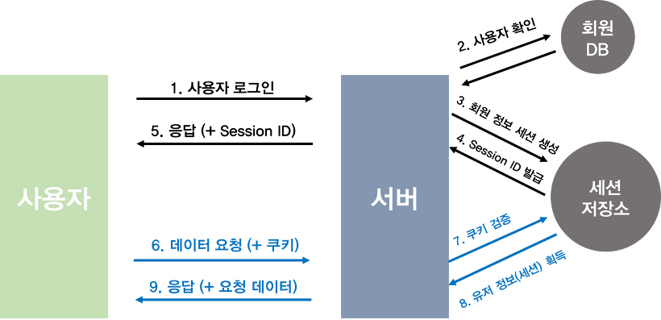

#
## 자료구조
#

### 자료구조를 배우는 이유

> `데이터를 체계적으로 저장`하고, `효율적으로 활용`하기 위해서 `자료구조를 사용`한다.

> 대부분의 `자료구조`는 `특정한 상황`에 놓인 문제를 해결하는 데에 `특화되어 있다.`

* `많은 자료구조를 알아두면`, 특정 문제를 해결하는 데에 `상황에 가장 적합한 자료구조`를 빠르게 찾아 `데이터를 정리하고 활용`하여 `문제를 빠르고 정확하게 해결`할 수 있다.

* 이것은 문제 해결 능력을 필요로하는 알고리즘과 굉장히 밀접한 연관성이 있다.
---
### 자료구조란?

> `자료구조`란 `여러 데이터들의 묶음을 저장`하고, `사용하는 방법을 정의`한 것이다.
---
### 데이터(data)는 무엇일까?

> `데이터`는 `문자, 숫자, 소리, 그림, 영상 등` 실생활을 구성하고 있는 `모든 값`이다.

* 이름, 나이, 키, 집 주소, 유전자 DNA까지 데이터로 분류할 수 있다.

> `데이터`는 그 자체만으로 어떤 정보를 가지기 힘들다.

* 예를 들어 나이라는 데이터만 알고 있다면, 사람의 나이인지, 강아지의 나이인지, 나무의 나이인지 알 수 없다.

> `데이터`는 `분석하고 정리`하여 `활용해야만 의미`를 가질 수 있다.

> `데이터`를 사용하려는 `목적에 따라 형태를 구분`하고, `분류하여 사용`한다.

> 필요에 따라 `데이터`의 큭징을 잘 `파악(분석)하여 정리`하고, `활용`해야 한다.
---
### 자료구조의 종류와 구분
---

* 무수한 상황에서 `데이터를 효율적으로 다룰 수 있는 방법`을 모두 모아, `자료구조`라는 이름을 붙였다.

#### 자주 등장하는 네 가지의 자료구조

* Stack, Queue, Tree, Graph

