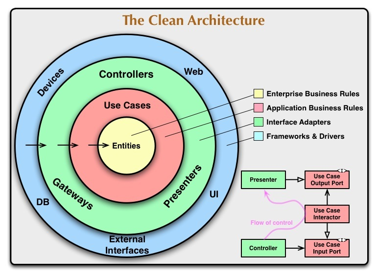

# 클린 아키텍처

## 클린 아키텍처란
추상화 개념으로써 관심사를 분리시키고 의존도를 낮추는 것에 목적인 아키텍처이다.

> 의존도를 낮추고 서로에게 주는 영향을 감소시키므로써 유지보수의 용이성이 항상시킨다.

기본적인 원리는 종속성 규칙을 지키는 것이다.

 각 코드의 종속성은 외부에서 내부로 안쪽으로만 가리킬 수 있고, 고수준 정책이 저수준 정책의 변경에 영향을 받지 않게 하는 것이다.

 ## 레이어 구조
 

 안쪽이 고수준, 바깥쪽이 저수준 정책을 의미한다.

 ### 엔티티
 도메인 계층이라고 불린다. 

 엔티티 계층은 하나 이상의 프로그램 간에 공유될 수 있다는 가정하에 만드는 객체이다

 ### 유즈케이스
 애플리케이션 계층이라고 불린다.

 레이어의 변경사항은 엔티티에 영향을 미치면 안되고 인프라 단의 디비나 UI같은 외부요소에 의해 영향을 안 받는다는 것이다.

 ### 인터페이스 어뎁터
 DB나 웹과 같은 바깥 계층에서 사용하기 편하게 엔티티 계층에서 데이터를 변환하는 어뎁터의 집합

 ### 프레임워크와 드라이버
 인프라 계층이라고 불린다.

 가장 외부에 있는 레이어로 DB와 프레임워크와 같은 세부정보를 나타낸다.

 시간이 지남에 따라 구성이 변경될 수 있으므로 엔티티 계층에 추상화하여 도메인 계층에 영향을 주지 않고 인터페이스로 수정및 업데이트가 가능하다.

 ## 주요 원칙
 1. 종속성 규칙
 * 캡슐화를 통해 내부 계층을 외부 계층과 분리시키고 내부는 외부를 모르게하여 영향을 받지 않도록 종속성의 흐름을 제어할 수 이싿.

 2. 추상화 원칙
 * 가장 안쪽에 있는 계층이 제일 추상화된 영역으로 바깥 영역으로 향할수록 내부 계츠을 활용하여 세부 사항을 구현한다.

 3. SOLID