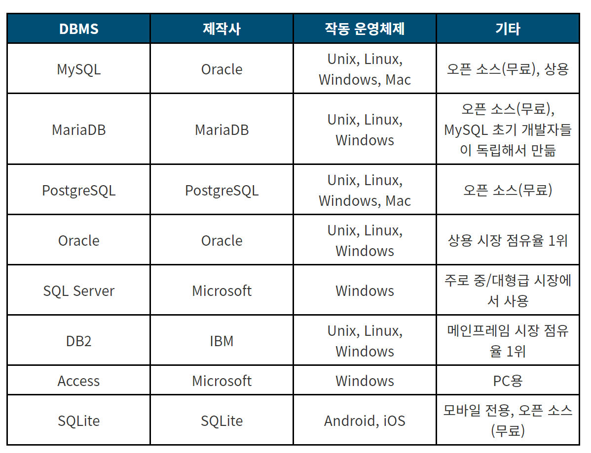
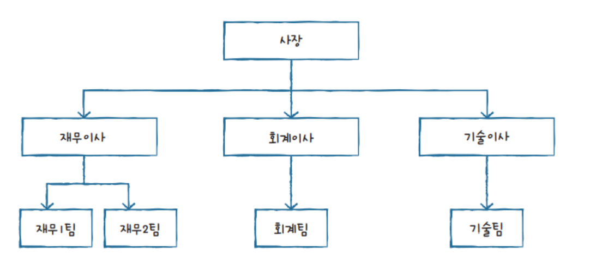
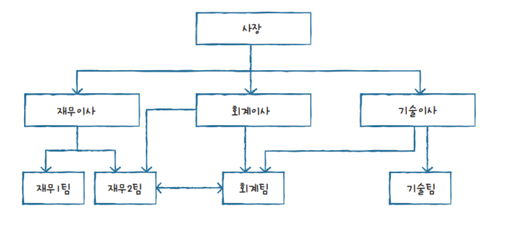
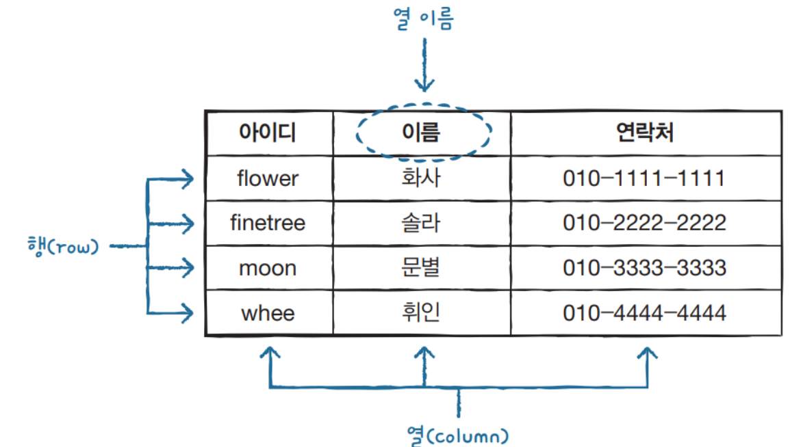

#
## DBMS
#

### DBMS란
---

* 데이터베이스를 `데이터의 집합`이라고 정의한다면, 이런 `데이터베이스를 관리하고 운영하는 소프트웨어를 DBMS(Database Management System)`라고 한다. 다양한 데이터가 저장되어 있는 데이터베이스는 여러 명의 사용자나 응용 프로그램과 공유하고 동시에 접근이 가능해야 한다.
 
---

### DBMS의 종류
---

* DBMS와 같은 소프트웨어는 특정 목적을 처리하기 위한 프로그램이다. 예를 들어 문서를 작성하기 위해서는 아래아한글(HWP)이나 워드(Word), 표 계산을 위해서는 엑셀(Excel)등을 설치해야된다.

* 마찬가지로 데이터베이스를 사용하기 위해서도 소프트웨어, 즉 DBMS를 설치해야 하는데 대표적으로 MySQL, 오라클, SQL서버, MariaDB등이 있다. 소프트웨어 각각의 사용 방법과 특징이 다르지만 특정 목적을 위해서는 어떤 것을 사용해도 무방하다.

* 대표적인 DBMS의 특징이다. SQL 공부가 처음이라면 이중에서 비교적 쉬우면서 실무에서도 인기가 많은 MySQL이라는 소프트웨어를 설치해서 사용하는 것을 추천한다.

---
### DBMS의 분류

* DBMS의 유형은 계층형(Hierarchical), 망형(Network), 관계형(Relational), 객체지향형(Object-Oriented), 객체관계형(Object-Relational) 등으로 분류된다. `현재 사용되는 DBMS 중에는 관계형 DBMS가 가장 많은 부분을 차지하며`, MySQL도 관계형 DBMS에 포함된다.

#### 계층형 DBMS

#### 망형 DBMS

#### 관계형 DBMS

