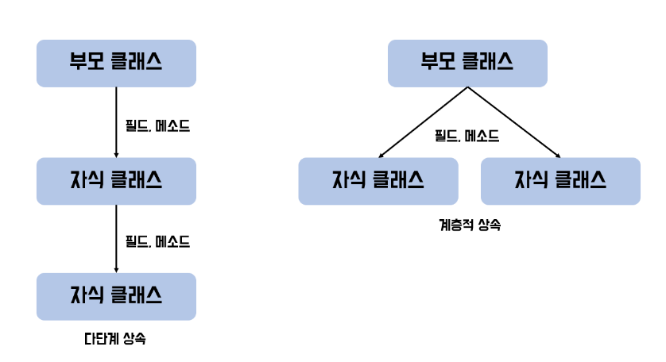
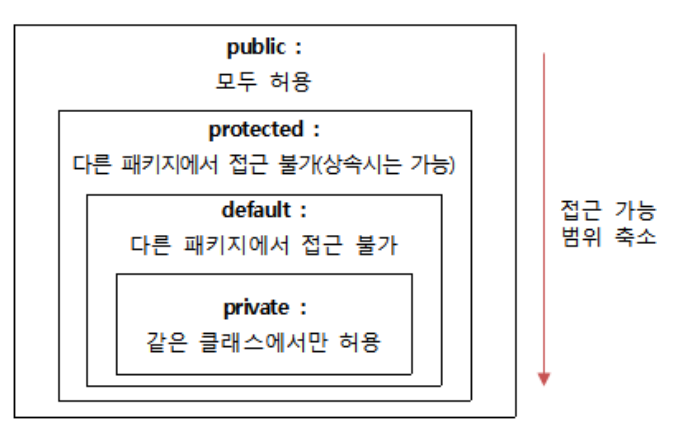

#
## Extends
#

> 객체지향 프로그래밍에서는 부모 클래스의 멤보를 자식 클래스에게 물려 줄 수 있습니다. 이렇게 상속하는 과정을 통해 잘 개발된 클래스를 재 사용하여 중복되는 코드를 최대한 줄여주며 부모의 클래스의 수정으로 모든 자식 클래스를 수정할 수 있는 효과를 볼 수 있기 때문에 유지보수를 하는데도 있어 강점이 있다.
---
### 자바의 상속 방식


> 클래스 간의 상속은 여러 개의 부모의 정보를 상속하는 다중 상속 방식을 제외하고는 모두 허용하고 있다. 주로 다단계 상속, 계층적 상속 두 가지 방식을 띄게 되는데 부모 클래스를 통해 자식, 손자까지 내려가는 방식을 다단계 상속이라고 하며 하나의 부모가 여러 개의 자식을 가지는 것을 계층적 상속이라고 한다.

#### 자바에서 다중상속이 안 되는 이유

> 예를 들어 만약, 상속받은 여러 개의 부모 클래스들에서 동일한 명칭의 필드나 메소드가 있으면?

* 어떤 부모 클래스의 필드와 메소드를 상속받아야 하는가?

* 어떤 부모 클래스에 어떻게 접근해야 하는가?
---
### 자바 상속 방법(Extends)
---

```java
// 부모 클래스 생성
class 부모{

}

// 부모 클래스 상속
class 자식 extends 부모 {

}
```
> 자바에서 상속은 extends라는 키워드를 통해 하실 수 있다. 위와 같이 상속받을 자식 클래스 뒤에 extends 키워드를 사용하고 부모 클래스를 적어주면 된다.
---
#### 자바 상속 예제

```java
class People{
    lass People{
    //필드(Feild)
    String name; //이름
    int age; //나이
    
    //메소드(Method)
    public void printMyself(){
        System.out.println("이름 : " + name);
        System.out.println("나이 : " + age);
    }
}

class Student extends People{
    //필드(Field)
    int korean_scroe; //국어성적
    int math_score; //수학성적
    int english_score; //영어성적
    
    //생성자(Constrouct)
    Student(String name, int age, int kor_score, int mat_score, int eng_score){
        super.name = name; //부모 필드 
        super.age = age; //부모 필드
        this.korean_scroe = kor_score;
        this.math_score = mat_score;
        this.english_score = eng_score;
    }
    
    //메소드(Method)
    public void printScore() {
        System.out.println("국어성적 : " + korean_scroe);
        System.out.println("수학성적 : " + math_score);
        System.out.println("영어성적 : " + english_score);
    }
}

public class Main {
    public static void main(String[] args) {
        Student student = new Student("홍길동", 18, 100, 90, 80);
        student.printMyself(); //부모 메소드 호출
        student.printScore(); //자식 메소드 호출
    }
}
    
}
```
> 상속을 하게 되면 보이지는 않지만 자식의 클래스에 부모의 정보들이 생성되어있다고 생각하시면 된다.
---
### super 키워드
---
> super 키워드는 자식 클래스에서 부모 클래스에서 부모 클래스를 가르킬 때 사용하는 키워드이다. 주로 부모 클래스의 필드에 접근, 메소드를 호출할 때 사용한다.
---
### 부모 클래스에서 상속이 안 되는 것
---
* 부모 클래스의 private 접근 제한을 갖는 필드 및 메소드는 자식이 물려받을 수 없다.

* 부모와 자식 클래스가 서로 다른 패키지에 있다면, 부모의 default 접근 제한을 갖는 필드 및 메소드도 자식이 물려받을 수 없다.

> 상속을 하더라도 자식 클래스가 부모의 모든 것들을 물려받는 것은 아니다. 필드나 메소드의 접근제어자가 public이거나 protected일 때만 상속이 가능하다.
---
### 접근제어자
---


> 접근제어자는 외부로부터 데이터를 보호하기 위해서 사용되며 public, protected, default, private가 있다. 위의 그림에서처럼 public -> private로 진행될수록 접근 가능 범위가 축소된다.