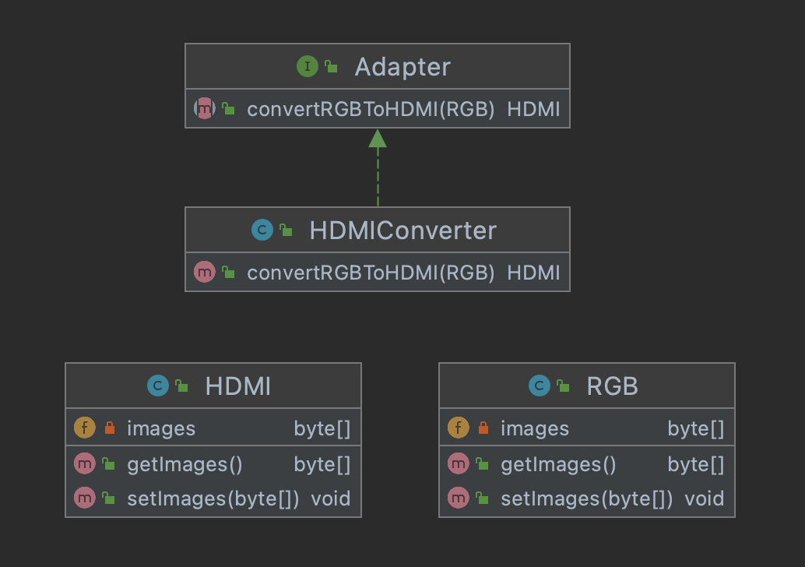

# Collection
## Collection이란

* 객체의 모음, 그룹

* 자바에서 모든 컬렉션 클래스와 인터페이스를 포함하는 `Collection Framework`

* Collection 인터페이스와 Map 인터페이스 자바 컬렉션 클래스의 주요 `루트`인터페이스



* Collection 인터페이스는 List, Set과 이미지에는 없지만 Queue 3가지의 상위 인터페이스로 분류

* Map은 Collection에 포함은 안하지만 Collection으로 분류한다.

## 사용 이유

1. 일괄된 API: Collection의 일관된 API를 사용해 Collection 밑에 있는 모든 클래스 Collection에서 상속받아 통일된 메서드 사용가능!

2. 객체 지향 프로그래밍의 추상화의 기본 개념이 성공적 구현

3. 속도 및 품질 향상: 유용한 데이터 구조 및 알고리즘은 성능을 향상시킨다.
---
## List Interface

1. ArrayList

* 동적 배열 제공한다. 표준 배열보다 느릴 수는 있지만 배열에서 많은 움직임이 필요한 프로그램에서 유용하다.

* 컬렉션에서 개체를 추가, 삭제하면 ArrayLsit의 크기가 자동으로 조절된다.

```java
import java.io.*;
import java.util.*;
  
class GFG {
    public static void main(String[] args)
    {
  
        // ArrayList 선언
        ArrayList<Integer> al
            = new ArrayList<Integer>();
  
        // ArrayList에 데이터 입력
        for (int i = 1; i <= 5; i++)
            al.add(i);
  
        // 결과 출력
        System.out.println(al);
  
        // 3번 데이터 제거
        al.remove(3);
  
        // 결과 출력
        System.out.println(al);
  
        // 하나씩 가져와서 결과 출력
        for (int i = 0; i < al.size(); i++)
            System.out.print(al.get(i) + " ");
    }
}
```

### 결과
```java
[1, 2, 3, 4, 5]
[1, 2, 3, 5]
1 2 3 5
```

### LinkedList

* 요소가 연속 된 위치에 저장되지 않고 모든 요소가 데이터 부분과 주소 부분이 있는 별도의 객체에 저장된다.

* 포인터와 주소를 사용해 데이터를 가져온다.

```java
import java.io.*;
import java.util.*;
  
class GFG {
    public static void main(String[] args)
    {
  
        // LinkedList 선언
        LinkedList<Integer> ll
            = new LinkedList<Integer>();
  
        // 값 입력
        for (int i = 1; i <= 5; i++)
            ll.add(i);
  
        // 결과 출력
        System.out.println(ll);
  
        // 3번 데이터 삭제
        ll.remove(3);
  
        // 결과 출력
        System.out.println(ll);
  
        // 결과를 하나씩 출력
        for (int i = 0; i < ll.size(); i++)
            System.out.print(ll.get(i) + " ");
    }
}
```

### 결과
```java
[1, 2, 3, 4, 5]
[1, 2, 3, 5]
1 2 3 5
```
---
## Set Interface

* 중복 값을 저장할 수 없는 정렬되지 않은 데이터 모음

* 중복을 방지하고 고유한 데이터만 저장해야하는 경우 사용

1. HashSet

* HashSet에 입력되는 데이터는 동일한 순서로 삽입되는 것을 보장하지 않는다.

* 이 클래스는 NULL 요소 삽입이 허용된다.

2. LinkedHashSet

* HashSet과 유사하지만 차이점은 데이터를 저장하는 순서를 유지한다.