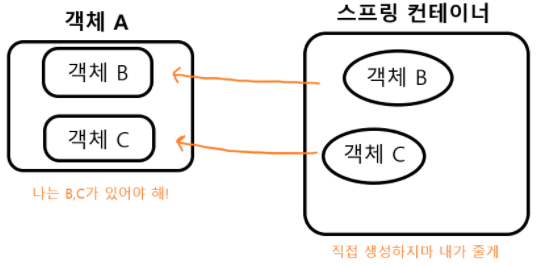

## IOC란

* Inversion Of Control

* 제어의 역전

### 예시
```java
public class A {
    private B b;

    public A() {
        b = new B();
    }
}
```
> 위를 보면 `A객체가 B객체에게 의존하고 있다`라는 것을 보여준다. 이 경우에는 제어를 개발자가 하고 있는 경우이다.
<br>

* Spring
```java

public class A {
    @Autowired
    private B b;
}
```
> 이 경우에는 @Autowired 어노테이션을 통해 객체를 주입 받은 경우이다. B객체가 스프링에서 관리 받는 Bean이라면 저런 어노테이션으로 직접 제어하는 않는 방법으로 객체를 주입할 수 있다.

## 장점
* 객체 간 결합도 낮춤

* 유연한 코드 작성 가능

* 가독성 증진

* 코드 중복 방지 가능

* 유지 보수 간편

## 정리
* 이러한 경우가 제어가 역전되었다는 경우이다.

* `@Autowired`어노테이션을 사용하게 되면 객체를 직접 주입하지 않고 개발자가 제어하지 않아도 Bean에서 관리하고 있는 객체라면 간편하게 주입 할 수 있다.
---
## DI
* 의존성 주입

* Dependency injection

* 원래는 A클래스 내부에서 다른 클래스의 메소드를 사용한다고 하면 B,C의 클래스가 변동사항이 있다면 A클래스도 그에 맞춰서 변경되어야 한다. 하지만 그것의 문제를 해결하는 방법이 DI이다.

## 예시


> 위 그림에서 나와 있는 거처럼 A객체가 B,C객체를 필요로 할 때 자바로 개발할 때는 new라는 생성자를 써서 객체를 직접 생성해서 해야했지만 spring에서는 직접 생성하지 않고도 `스프링 컨테이너`에 있다면 거기서 객체B,C를 객체A로 간편하게 주입시킬 수 있다.

### 주입 예시
1. Field Injection(필드 주입)

* `Field Injection`은 의존성을 주입하고 싶은 필드에 `@Autowired 어노테이션`을 붙여즈면 의존성이 주입된다.

```java
@RestController
public class PostController {
    @Autowired
    private PostService postService;
}
```
* 주입받으려는 빈의 생성자를 호출하여 빈을 찾거나 빈 팩토리에 등록

* 생성자 인자에 사용하는 빈을 찾거나 만듦

* 필드에 주입

2. Setter Injection(수정자 주입)

* setter메서드에 @Autowired 어노테이션을 붙여 의존성을 주입하는 방식

```java
@RestController
public class PostController {
    private PostService postService;

    @Autowired
    public void setPostService(PostService postService) {
        this.postService = postService;
    }
}
```
* 주입받으려는 빈의 생성자를 호출하여 빈을 찾거나 빈 팩토리에 등록

* 생성자 인자에 사용하는 빈을 찾거나 만듦

* 주입하려는 빈 객체의 수정자를 호출하여 주입

    ### 위 두 방식은 런타입에 의존성을 주입하기 때문에 의존성을 주입하지 않아도 객체가 생성할 수 있다.

3. Constructor Injection(생성자 주입)

* 생성자를 사용하여 의존성을 주입하는 방식

```java
@RestController
public class PostController {
    private final PostService postService;

    public PostController(PostService postService) {
        this.postService = postService;
    }
}
```
* 생성자의 인자에 사용되는 빈을 찾거나 빈 팩토리에서 만든다.

* 찾은 인자 빈으로 주입하려는 생성자를 호출한다.

### 장점

* NullPointerException이 발생하는 것을 막는다.

* 불변성을 활용할 수 있다.

* SRP을 지킬 수 있도록 유도한다.
