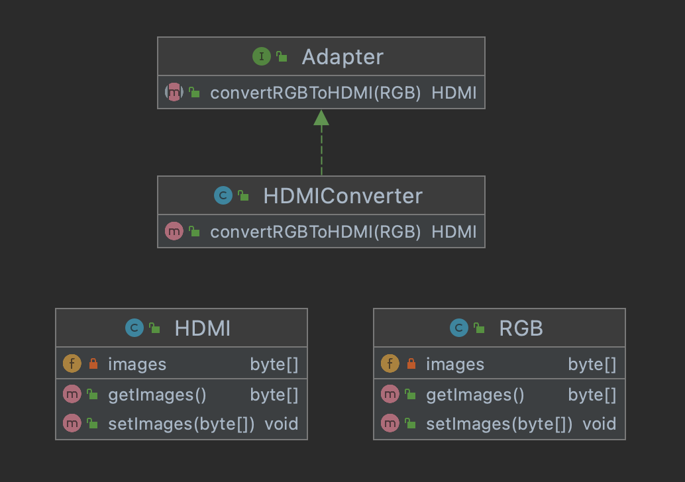

#
## 어댑터 패턴
#

### 어댑터 패턴

* 어댑터 패턴은 기존 코드를 재사용하기 위해 내적, 외적 구조를 변환하는 작업을 처리한다.

* 어댑터 패턴은 코드를 재사용하기 위한 인터페이스를 처리하고 인터페이스 차이 때문에 사용할 수 없는 경우 많이 응용되는 패턴이다. 또 기존 코드에 오류가 있거나 보정 작업이 필요한 경우에도 유용하다.

* 어댑터패턴은 오래된 레거시 코드나 라이브러리를 재사용할 때 유용한 패턴이다. 또한, 어댑터 패턴은 서로 호환되지 않는 인터페이스를 가진 코드를 결함하여 응용 프로그램에서 동작할 수 있도록 도와준다.
---

### 어댑터 패턴 구조

* 동작은 정상적으로 하지만 오래된 인터페이스를 지닌 RGB를 HDMI로 변환해야하는 케이스를 생각해보면
우리는 HDMIConverter라는 어댑터 클래스를 이용해서 인터페이스 규격을 변경하여 사용할 수 있다.
---

### 장점

1. 어댑터 패턴은 구조 패턴 중 하나로 기존 클래스를 감싼 새로운 클래스를 객체의 인터페이스를 재구성한다.

2. 객체를 구성으로 결합하면 느슨한 연결 방식으로 보다 많은 유연성을 확보할 수 있다. 그리고 구성은 프로그램이 실행되는 도중에도 객체를 변경할 수 있다.
3. 어댑터는 복잡한 객체 구조를 깔끔하게 정리하는 데 유용하다.
---

### 단점

1. 객체를 구성으로 결합하면 어댑터는 클라이언트에서 사용하는 인터페이스 방식으로 메서드를 새로 생성한다. 어댑터가 새로운 메서드를 재구성할 때 추가 코드가 필요하다.

2. 프로젝트에서 어댑터 패턴을 적용한다고 코드의 성능이 개선되지는 않는다. 오히려 어댑터를 통해야 하므로 속도가 저하된다.
