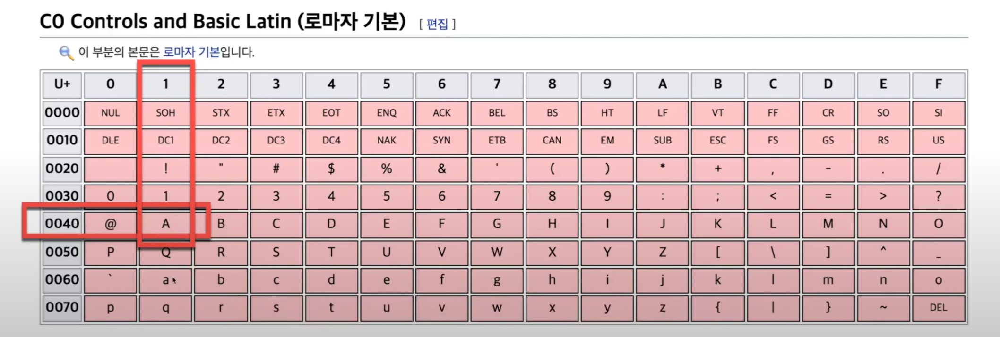

#
## 문자(char)타입
#

### 문자타입
---
* 문자는 작은 따옴표로 묶인 문자 하나를 말한다.

* 문자는 2byte크기를 가지며 유니코드 값을 가진다.

* 아래의 위키 페이지를 보면 유니코드 값을 확인할 수 있다.
    * https://ko.wikipedia.org/wiki/유니코드_0000~0FFF
---
### 유니코드표 보기
---

* 유니코드 0041이 문자 A를 표현한다.

* 16*4 + 1 = 65
    

---
### 문자 타입은 정수 타입이기도 하다.
---
* 문자 타입은 0부터 65535까지 저장할 수 있는 정수 타입이기도 하다.
---
### 예제 - 문자를 정수형으로, 정수를 문자로 변환
---

* 유니코드 97번째 값은 문자'a'이다.(유니코드 표를 확하자.)

```java
public class CharExam2 {
    public static void main(String[] args) {
        char c1 = 'a';

        System.out.println((int)c1);
        
        char c2 = (char)97;

        System.out.println(c2);
    }
}
```