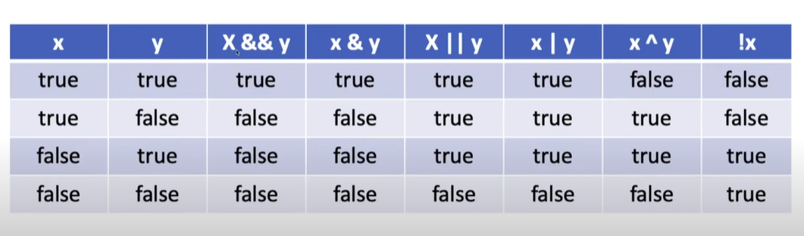

#
## 논리형 타입과 연산자
#

### 자바의 타입
1. 기본형 타입

    * 논리형, 문자형, 정수형, 실수형이 존재한다.

    * 논리형 타입은 boolean 사용

    * 정수형 타입은 byte, short, int , long 사용

    * 실수형 타입은 float, double 사용

    * 문자형 타입은 char 사용

2. 레퍼런스 타입

    * 위에 기본형 타입을 제외한 나머지 타입
---
### 논리형 타입 boolean
---
* boolean 타입은 true, false 2가지 값중에 하나를 가질 수 있다.

* 초기화 하지 않으면 기본적으로 false값을 가진다. 참고로 메소드 안에서는 변수를 선언한 후 초기화하지 않고 사용하면 `java: variable 변수명 might not have been initialized`와 같은 오류가 발생한다.

#### 참(true)과 거짓(false)이 나오는 식

* 비교연산자와 논리연산자를 이용한 식의 결과는 참이나 거짓이 결과로 나온다.

* 비교 연산자: ==, !=, <, >, <=, >=

* 논리 연산자: &&, ||, &,|,^,!

* 비교 연산자, 논리 연산자와 함계 산술 연산자도 함께 사용될 수 있다. 산술 연산자는 덧셈, 뺄셈등을 말한다.
---
### 비교 연산자
---
* 10은 5보다 크다. 참인가? 거짓인가? 자바에서 표현하면 다음과 같다.
```java
10 > 5
```
* 위의 식의 결과를 변수에 저장하고 싶다면? 아래와 같이 표현한다. flag는 논리형 타입 변수로 false로 초기화 된다. 그리고 나서 10이 5보다 크다가 참이라면 flag는 true값을 가지게 된다.
```java
boolean flag = false;
flag = 10 > 5;
```
---
### 논리연산자 and(&&) 와 or(||)
---

* `a는 20보다 크고, a는 50보다 작다.`라는 표현은 자바에서 다음과 같이 표현한다.
    * `a > 20 && a < 50`

* 'a'는 20보다 크거나, a는 50보다 작다. 라는 표현은 자바에서 다음과 같이 표현한다. `a > 20 || a < 50`

* 2가지 조건을 모두 만족해야 하는 경우엔 and연산자인 &&를 사용하고, 2가지 조건중 하나만 만족해도 될 경우에는 ||를 사용한다.

* `&&` 대신에 `&`를 `||`대신에 `|`를 사용해도 같은 결과가 나온다.

### 논리연산자 ^(exclusive-or 또는 XOR라고 말한다.)

* 2개의 식의 논리 값이 서로 다를 경우 참이 된다. 아래의 식이 참이려면 한쪽은 참이고, 한쪽은 거짓이 나와야 한다. 예를 들어 a가 31이라는 값을 가질 경우 `true & false`가 되니 이 때 결과는 참이 나온다.
```
a > 10 ^ a < 20
```

### 부정 연산자 !

* 논리형 값을 부정한다. true는 false로 바꾸고, false는 true로 바꾼다, 10은 5보다 크다는 참이다. 하지만 그 결과는 부정하게 되니 논리형 변수 a에는 false가 저장되게 된다.
```java
boolean a = !(10 > 5);
```

#### 논리 연산자 정리


---

### 불린형 타입은 메모리를 얼마나 사용하나

* 불린형 타입은 1byte(8bit)를 사용한다. 사실 1비트로도 참과 거짓은 표현할 수 있다. 0은 거짓, 1은 참으로 표현하면 된다. 하지만 컴퓨터는 자료를 표현하는 최소 단위가 1byte이다. 그렇기 때문에 불린형 타입은 메모리에 1byte를 사용하게 된다.