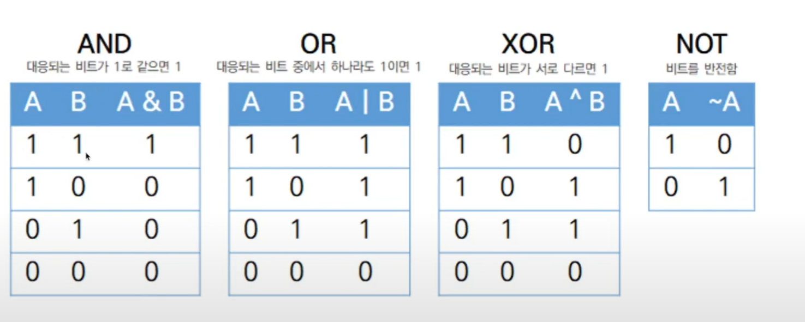

#
## 비트 연산자
#

### 비트(bit)와 바이트(byte)
---
* 비트는 컴퓨터가 처리하는 정보의 최소 단위인데, 한 개만으로는 많은 양의 데이터를 나타내기에 턱없이 부족하기 때문에 정보를 표현하는 기본단위로는 8개의 비트를 묶은 바이트(Byte)를 사용한다.

* 1byte는 `00000000`부터 `11111111`까지 값을 표현할 수 있다.

* 1byte는 정수로 표현하면 0부터 254까지 표현가능하다.

* 1byte를 16진수로 표현하면 `00`부터 `FF`까지 표현가능하다. 4비트는 0부터 15까지 표현가능하기 때문이다.
---
### 비트 연산자는 논리 연산자와 비슷하지만, 비트(bit)단위로 논리 연산을 할 때 사용하는 연산자이다.
---

* 비트 연산자의 종류로는 &,|,^,~,<<,>>,>>>이 있다.

* &는 and, |는 or,&는 xor, ~는 not을 의미한다.

* <<는 좌측 시프트(shift), >>는 우측 시프트(shift),>>>는 우측 양수화 시프트라고 한다.

* &,|,^는 논리 연산자로도 사용된다.
---
### and, or, xor, not 비트 연산 결과
---


---
### 비트연산자는 바이트를 구성하고 있는 bit를 연산하는 연산자이다.
---
```java
    00000000
&   11111111
-------------
    00000000
```
* 두개의 바이트에 각각 `00000000`과 `11111111`이 저장되어 있을 때 2개의 바이트에 대한 and(&)연산의 결과는? 각각의 자리수에 해당하는 비트끼리 and연산을 한 결과가 구해진다.
---
### >> 와 <<

* `<<`는 명시된 수만큼 비트들을 전부 왼쪽으로 이동시킨다.

* `>>`는 부호를 유지하면서 지정한 수만큼 비트를 전부 오른쪽으로 이동시킨다.
    * 정수형 타입을 비트로 표현했을 떄, 맨 좌측의 비트를 부호화 비트라고 한다. 맨 좌측의 비트가 1이면 음수, 0이면 양수를 나타낸다.
---
