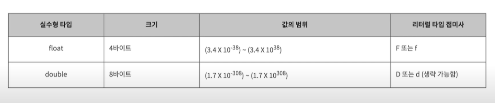
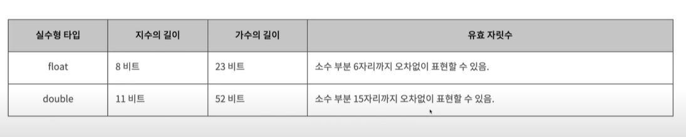

#
## 정수, 실수 그리고 산술연산자
#

### 정수형 타입 byte, short, int, long

* byte타입은 1byte크기의 정수 값을 가질 수 있다.

* short타입은 2byte크기의 정수 값을 가질 수 있다.

* int타입은 4byte크기의 정수값을 가질 수 있다.

* long타입은 8byte크기의 정수값을 가질 수 있다.

* 리터럴 값인 숫자 5는 int타입이다.

* 리터럴 값인 숫자 5L은 long타입이다.(숫자 뒤에 L또는 I이 붙는다)
---
### 각 타입별 값의 범위
---
* byte
    * 크기: 1바이트
    * 값의 범위: -128 ~ 127

* short
    * 크기: 2바이트
    * 값의 범위: -2¹⁵~ (2¹⁵ - 1)

* int 
    * 크기: 4바이트
    * 값의 범위: -2,147,483,648 ~ 2,147,483,647

* long
    * 크기: 8바이트
    * 값의 범위: -9,223,372,036,854,775,808 ~ 9,223,372,036,854,775,807
---
### 실수형 타입 float, double
---
* float타입은 4byte크기의 실수 값을 가질 수 있다.

* double타입은 8byte크기의 실수 값을 가질 수 있다.

* 리터럴 값인 숫자 5.2는 double타입이다.

* 리터럴 값인 숫자 5.2f는 float타입이다. (숫자 뒤에 F또는 f가 붙는다.)

#### 각 타입별 값의 범위



#### float와 double의 유효 자릿수 차이


---
### 산술 연산자
---
* 정수와 실수는 덧셈(+), 뺄셈(-), 곱셈(*), 나눗셈(/), 나머지구하기(%)를 할 수 있다.
```java
a = 5 + 4;
b = 4 - 3;
c = 3 * 2;
d = 5 / 2;
e = 4 % 3;
```
* a는 9, b는 1, c는 6, d는 2, e는 1의 값을 가진다.

* 정수를 정수로 나누면 잘림 현상이 발생한다. 2.5가 아닌 2가 d에 저장된다.

* 나머지 연산자는 앞의 숫자를 나누고 나눈 나머리 값을 구한다.
---
### 증가 연산자와 감소 연산자
---
* 증가 연산자(++)를 사용하면 1이 증가된다.

* 감소 연산자(--)를 사용하면 1이 감소된다.

* 증가 연산자와 감소 연산자는 변수의 앞에 붙으면 전위 증가 연산자와 전위 감소 연산자라 부르고, 변수의 뒤에 붙으면 후위 증가 연산자와 후위 감소 연산자라 말한다.
```java
++a, a++, --a, a--
```

```java
a = 5;
a++;

b = 4;
b--;
```
---
### 산술 대입 연산자
---
* 산술 대입 연산자는 +=, -=, *=, /=, %=가 있다.

```java
a = 5;
a += 3;

b = 4;
b -= 2;

c = 8;
c *= 2;

d = 4;
d /= 2;

e = 5;
e %= 2;
```
---
### 괄호 ()
---
* 괄호가 있을 경우 괄호 안의 내용부터 계산한다.
```java
a = 3;
b = 5;

c = a * (b + 5);
d = a * b + 5;
```
---
### 정수와 실수의 최솟값과 최댓값
---
* int타입과 double타입이 표현할 수 있는 최댓값과 최솟값을 출력한다.

```java
public class NumberExam1 {
    public static void main(String[] args) {
        int maxInt = Integer.MAX_VALUE;
        int minInt = Integer.MAX_VALUE;

        double maxDouble = Double.MAX_VALUE;
        double minDouble = Double.MAX_VALUE;

        System.out.println(maxInt);
        System.out.println(minInt);

        System.out.println(maxDouble);
        System.out.println(minDouble);
    }
}
```
---
### 오버플로우(overflow)

* 아래의 프로그램은 결과가 얼마나 나올까?

* 계산 결과가 최댓값을 넘거나, 최솟값보다 작을 경우 음수는 양수로, 양수로 음수로 바뀌는 문제가 발생한다. 이를 오버플로우라고 한다.

```java
public class NumberOverflow {
    public static void main(String[] args) {
        int value = 10;
        int maxInt = Integer.MAX_VALUE;

        System.out.println(value + 1);
        System.out.println(maxInt + 1);
    }
}
```