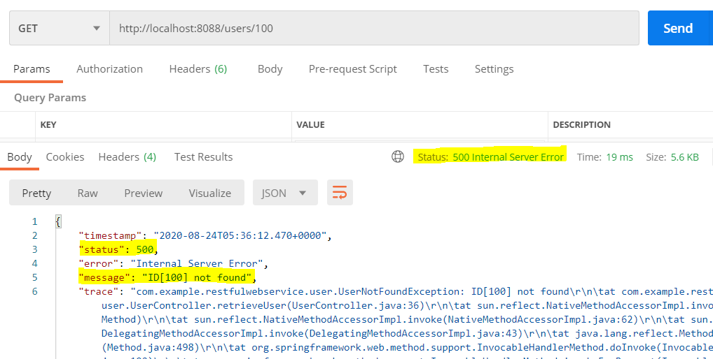

# AOP
## 관점 지향 프로그래밍(Aspect Oriented Programming)란

* 관심사에 따라 클래스를 분리한다.

* OOP의 설계방식으로는 해결 할 수 없는 아쉬운점을 AOP가 서비스 전역에 흩어져 있는 관심사를 비즈니스 로직으로 모듈화를 하여 깨끗한 코드를 작성할 수 있다.

* 인프라 혹은 부가기능의 모듈화
    * 예: 모니터링 및 로깅, 동기화, 오류 검사 및 처리, 성능 최적화 등
    * 각각의 모듈들의 주 목적 외에 필요한 부가적인 기능들

* 공통된 기능을 재사용하는 기법

## OOP와 AOP의 차이점

* OOP에서는 공통된 기능을 재사용하는 방법으로 상속이나 위임을 사용

* 하지만 전체 애플리케이션에서 여기저기 사용되는 부가기능들은 상속이나 위임으로 처리하기에는 깔끔하게 하기 힘들다.

* 그래서 쓰는 것이 AOP이다.

## AOP 장점

* 흩어진 공통 기능이 하나의 장속에서 관리할 수 있어서 유지보수가 좋다.

* 핵심 로진과 부가 기능의 명확한 분리를 할 수 있어 핵심 로직은 자신의 목적 외에 사항들에 신경쓰지 않는다.

## 적용 방식

* 컴파일 시점
    * 모든 지점에 적용 가능
    
    * .java 파일을 컴파일러를 통해 .class를 만드는 시점에 부가 기능 로직을 추가하는 방식

* 클래스 로딩 시점
    * .class 파일을 JVM 내부의 클래스 로더에 보관하기 전에 조작해 부가 기능 로직 추가 방식

    * 모든 지점 적용 가능

* 런타임 시점
    * 스프링에서 사용하는 방식

    * 프록시는 메서드 오버라이딩 개념으로 동작하기 때문에 메서드에만 적용 가능 -> 스프링 빈에만 AOP를 적용 가능

