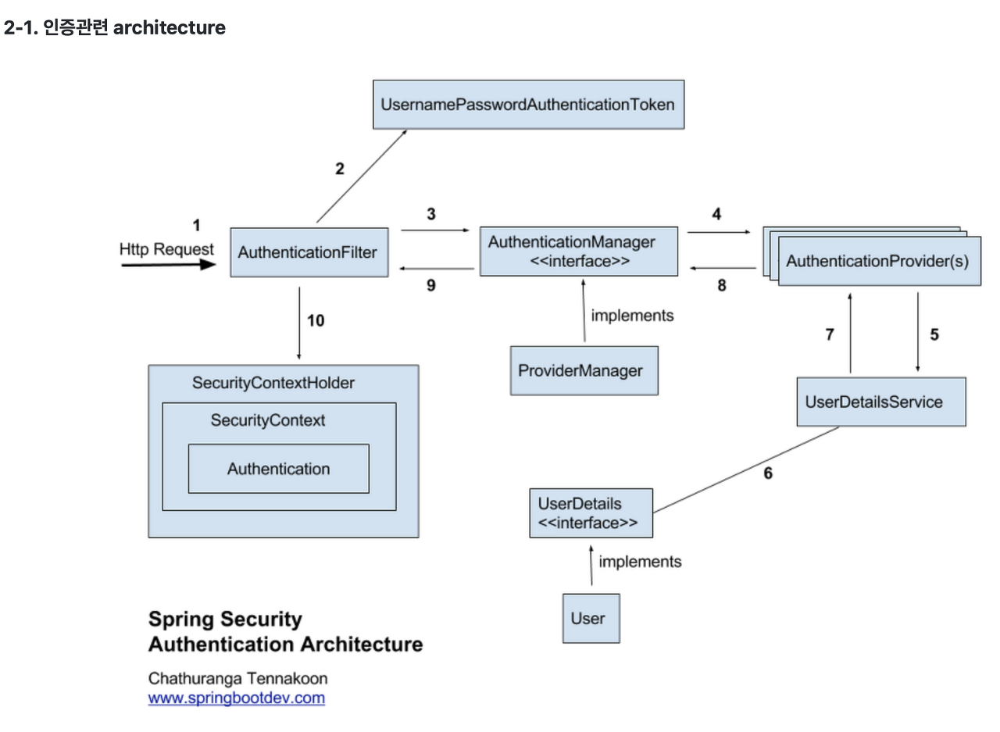

# Spring Security
## 스프링 스큐리티란

* spring 기반의 애플리케이션의 보안을 담당하는 스프링 하위 프레임워크

* '인증'과 '권한' 부분을 Filter에 따라 처리한다.

* Filter는 Dispatcher Servlet에 가기 전에 처리되어 URL 요청을 받지만, Intercepter는 Dispatcher와 Controller사이에 위치한다는 점에 차이가 있다.

* 스프링 시큐리티에서 보안쪽으로 많은 옵션을 제공하기 때문에 개발자에겐 보안로직을 짜지않아도 되는 장점이 있다.

## 인증관련된 아키텍쳐

* 인증(Authentication) : 해당 사용자가 본인이 맞는지 확인하는 과정

* 인가(Authorization): 인증된 사용자가 요청한 자원에 접근 가능한지 결정하는 과정

* 시큐리티는 기본적으로 인증 절차를 거친 후에 인가 절차로 진행된다.

* 이런 인증과 인가를 위해 `Principal`을 아이디로, `Credential`을 비밀번호로 사용하는 `Credential` 기반의 인증 방식을 사용한다.

    * Principal(접근 주체): 보호받는 Resource에 접근하는 대상

    * Credential(비밀번호): Resource에 접근하는 대상의 비밀번호