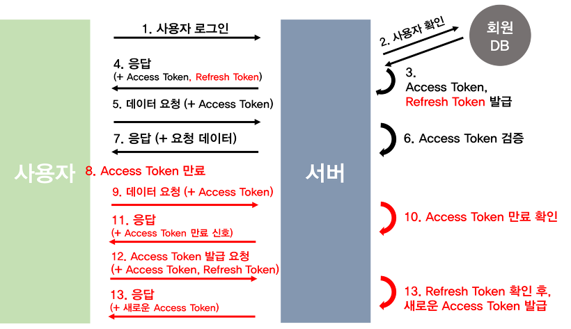

# Access Token / Refresh Token
## Refresh Token이란?

* Access Token은 유효기간도 짧고 보안이 취약하고 그냥 Token은 계속 로그인 하면 자주 발급받기 때문에 불편해서 나온 토큰이 Refresh Token이다.

* Refresh Token도 Access Token과 똑같은 JWT이다.

* Access Token보다 유효기간이 더 길다.

## Access Token과 Refresh Token 인증 과정

1. 유저가 아이디와 password를 입력하여 로그인을 시도한다.

2. 그것을 DB를 조회하여 유저가 맞는 지 확인한다(PW는 암호화가 되는 경우가 많다)

3. 확인을 하고 Access Token과 Refresh Token을 발급받는다(일반적으로 Refresh Token은 DB에 저장한다.)

4. 서버가 유저에게 Access Token과 Refresh Token을 가지고 응답을 보낸다.

5. 그러면 그 response에 있던 Access Token을 헤더에 넣어 요청을 보낸다

6. Access Token을 검증해 그것에 맞는 정보를 보낸다.

7. 시간이 지나 Access Token이 만료되었다.

8. 그리고 나서 만료된 Access Token을 헤더에 넣어서 request를 보낸다.

9. 서버에서 만료된 것을 확인하면 권한없음으로 response를 보낸다.

10. 그러면 유저가 Access Token과 Refresh Token을 함께 서버로 보낸다.

11. 서버에서 받은 Access를 확인한 후 refresh도 만료가 되지않았는 지 사용자 DB에 있던 refresh가 맞는 지 확인 후 다시 access를 발급한다.

12. 발급한 Token으로 다시 요청을 진행한다.

### 장점

* Access Token만 있을 떄와는 더 안전하다.

### 단점

* 구현이 더 복잡하고 프로세스가 길어 프론트나 서버쪽에서 자연스럽게 하기 힘들어졌다.

* Access Token이 만료될 때마다 발급받는 것이 요청 횟수가 많아 자원낭비로 이어진다.
