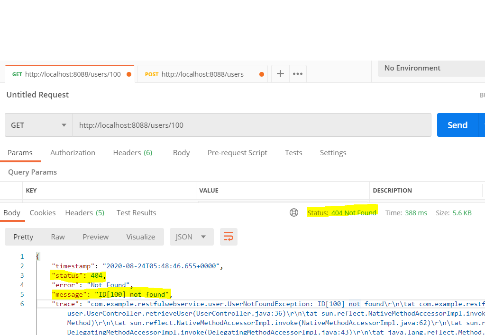

## `@SpringBootApplication`

* Spring Boot를 자동으로 실행시켜주는 어노테이션

* Bean 등록은 두 단계로 진행된다.

    1. @CompnentScan을 통해 Component들은 Bean으로 등록

    2. @EnableAutoConfiguration을 통해 미리 정의해둔 자바 설정 파일들을 Bean으로 등록한다.
---
## `@Component`

* 개발자가 직접 작성한 Class를 Bean으로 등록하기 위한 어노테이션

> @ComponentScan 선언에 의해 특정 패키지 안의 클래스들을 자동 스캔하여 @ComponenetScan 어노테이션이 있는 클래스들에 대해 빈 인스턴스를 생성한다.

> @Component 어노테이션은 Controller, Service,DAO 세가지 이외의 클래스에만 사용 권장
---
## @Controller

* Spring MVC의 Controller로 사용되는 클래스 선언을 단순화 시키는 어노테이션
---
## @Service

* 비지니스 로직이 들어가는 Service로 사용되는 클래스임을 명시하는 어노테이션
---
## @Repository

* DB연동 작업을 하는 클래스인 DAO에 특화된 어노테이션

* 해당 클래스에서 발생하는 DB 관련 예외를 Spring의 DAOException으로 전환할 수 있는 장점!
---
## @RequestMapping

* 클라이언트에 요청받는 주소를 클랫와 연결시켜주는 어노테이션
---
## @Resource, @Autowired, @Inject

|-------|**@Resource**|**@Autowired**|**@Inject**|
|-------|---------|----------|-------|
|범용|Java에서 쓰는 어노테이션|SPring Framwork에서 지원|Java에서 지원하는 어노테이션|
|사용 위치|필드, 파라미터가 한개인 setter 메소드|필드, 생성자,setter 메소드|필드, 생성자, setter 메소드|
|연결 or 검색 방식|이름(id)이 일치하는 객체 자동 주입|타입이 일치하는 객체 자동 주입|타입이 일치하는 객체 자동 주입|
|특이사항|스프링에서 사용 가능|스프링에서 사용 가능|스프링에서 사용 가능|

---
## @RestController

* `@Controller + @ResponseBody`의 형태인 어노테이션

* 주용도는 해당 클래스가 ajax 요청을 받아 Json/Xml 형태로 객체 데이터를 반환하는 것

### 기존 MVC @Controller와의 차이점 HTTP Response Body가 생성되는 방식 차이

* @RestController(주용도 데이터 리턴) : 클래스의 리턴타입이 String이면 문자열 데이터 의미

* @Controller(주용도 view 리턴) : 클래스의 리턴타입이 String이면 jsp파일명을 의미

### @Controller의 실행 흐름
> Client -> Request -> Dispatcher Servlet -> Handler Mapping -> `Controller` -> `View` -> `Dispatcher` Servlet -> Response -> Client

### @ResponseBody의 실행 흐름

> Client -> Request -> Dispatcher Servlet -> Handler Mapping -> `Controller(ResponseBody)` -> Response -> Client

### @RestController의 실행 흐름

> Client -> HTTP Resquest -> Dispatcher Servlet -> Handler Mapping -> `RestController(자동 ResponseBody추가)` -> `HTTP Response` -> Client
---
## @ResponseBody

* 자바 객체를 HTTP 요청의 body 내용으로 변환/매핑하는 어노테이션

## @RequestBody

* HTTP 요청의 body 내용을 전달받아 자바 객체로 변환/매핑하는 어노테이션
---
## @PathVariable

* URL 경로 주소에 사용하는 값을 매개 변수로 사용 가능하게 해주는 어노테이션

* @RequestMapping의 URL 정의 부분과 Method 내의 Parameter 부분에 정의를 하여 사용 가능

* @RequestMapping 어노테이션 값으로 {템플릿 변수}를 사용한다.

```java
@RequestMapping(value="/{rno}",method=RequestMethod.DELETE)
public ResponseEntity<String> replyDel(@PathVariable("rno") int rno){
    
	ResponseEntity<String> entity = null;
	
	try {
		service.replyDel(rno);
		entity=new ResponseEntity<String>("SUCCESS",HttpStatus.OK);
	}catch(Exception e) {
		e.printStackTrace();
		entity=new ResponseEntity<String>(e.getMessage(),HttpStatus.BAD_REQUEST);
	}
	
	return entity;
}
```

> Rest방식에서는 `value=""`주소를 경로(Path)형태로 만들어 주기 -> 주소면서 데이터를 포함하고 있는 의미
---
## 예외 처리하는 어노테이션

### @ExceptionHandler

* 기존 Controller에 @ExceptionHandler 어노테이션을 사용하는 메소드를 추가하여 예외를 처리하는 방식

* @RequestMapping대신 @ExceptionHandler 어노테이션을 사용하면 된다.

* 사이트 전체에 공통으로 적용해야할 컨트롤러에는 @ControllerAdvice를 사용한 예외 처리가 효율적이다.

### @ResponseStatus

* HTTP Status Code 제어를 위한 Exception handling 특정한 예외 지정

> 예) 존재하지않는 id값을 검색하여 null 값을 return 받았을 때 예외처리를 시작하기 전 에러화면을 보면 상태코드 값이 `500`이다.


* 이 값은 서버에서 문제가 생겼을 때 통상적으로 반환되는 상태코드 값

* 문제가 있다면 정확한 원인을 파악하기 힘들다는 단점이다.

* 이럴 때 사용하는 것이 @ResponseStatus 어노테이션이다.

```java
// UserDAOService

public User findOne(int id){
    for(User user : users){
        if(user.getId()== id){
            return user;
        }
    }
    return null;
}
// UserController

@GetMapping("/users/{id}")
public User retrieveUser(@PathVariable  int id){
    User user = service.findOne(id);

    if(user==null){
        throw new UserNotFoundException(String.format("ID[%s] not found", id));
    }
    return user;
}
// UserNotFoundException 예외 클래스 생성

package com.example.restfulwebservice.user;
import org.springframework.http.HttpStatus;
import org.springframework.web.bind.annotation.ResponseStatus;

// HTTP Status Code
// 2XX -> OK
// 4XX -> Client 오류
// 5XX -> Server 오류
// 데이터가 존재하지않는 오류기때문에
// '5XX 오류메시지'가 아니라 'NotFound' 오류메시지지 전달해주기
@ResponseStatus(HttpStatus.NOT_FOUND)
public class UserNotFoundException extends RuntimeException {
    public UserNotFoundException(String message) {
        super(message);
    }
}
```


---
## @ControllerAdvice

* Spring AOP를 이용한 Exception handling으로 `예외처리 전용 컨트롤러`생성하여 예외 처리하는 어노테이션

* 모든 컨트롤러가 실행될 때 @ControllerAdvice 어노테이션을 가지고 있는 빈이 자동 실행된다.
